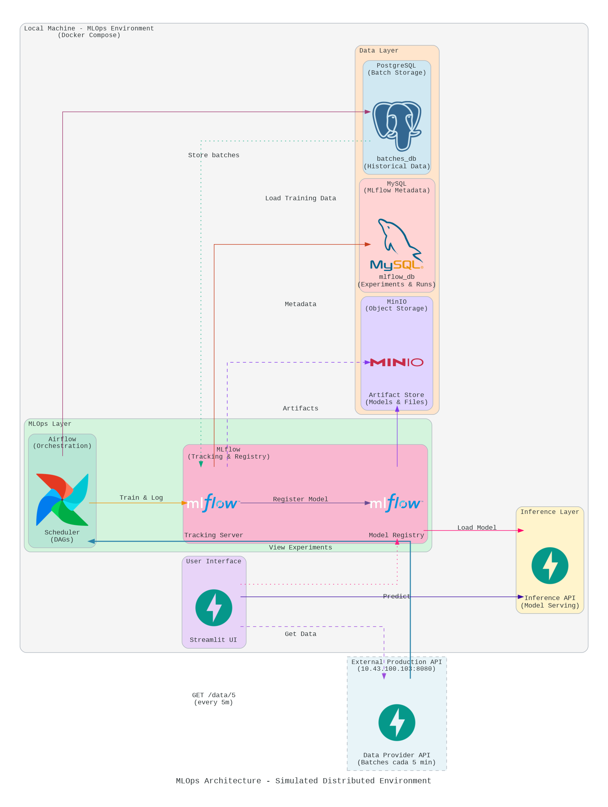

# Proyecto 1 - Grupo 5

## Descripción
El proyecto tiene como objetivo que los estudiantes implementen un entorno de MLOps en una máquina virtual utilizando Docker Compose. Este entorno incluir ́a servicios esenciales como Airflow para la orquestaci ́on, MLflow para el registro de experimentos y modelos, Minio como almacenamiento de objetos para MLflow, y MySQL como base de datos para la metadata de MLflow. Adem ́as, los estudiantes trabajar ́an con una API externa para obtener datos aleatorios que ser ́an utilizados para entrenar un modelo de inteligencia artificial.


# Solución

## Arquitectura



La arquitectura está dividida en varias capas lógicas que trabajan en conjunto. A continuación, se detalla la función de cada servicio y cómo se relacionan entre sí.

1. Capa de Origen de Datos (External Production API)
El flujo comienza con una API externa (FastAPI) que actúa como un proveedor de datos. Esta API entrega lotes de datos cada 5 minutos, simulando una fuente de datos de producción.
    * FastAPI (Data Provider API): Este servicio es el punto de partida del flujo de datos. Un orquestador se conecta a él para obtener los datos necesarios para el entrenamiento o la predicción.

2. Capa de Orquestación y Lógica (MLOps Layer)
Esta capa es el cerebro de la arquitectura y coordina todas las tareas, desde la ingesta de datos hasta el entrenamiento del modelo.
   
    * Airflow (Scheduler): Apache Airflow es el orquestador que gestiona y programa los flujos de trabajo (DAGs). Airflow se conecta a la API externa cada 5 minutos para obtener nuevos lotes de datos. Una vez que obtiene los datos, los almacena en la base de datos de lotes y activa el proceso de entrenamiento del modelo, enviando la información a MLflow.
    * MLflow (Tracking & Registry): MLflow es una plataforma para gestionar el ciclo de vida de ML. Se utiliza para:

      Tracking Server: Rastrea los experimentos de entrenamiento, incluyendo parámetros, métricas y el código utilizado.

      Model Registry: Almacena y gestiona versiones de modelos, facilitando la transición de modelos del entorno de entrenamiento al de producción.

3. Capa de Datos (Data Layer)
Esta capa es la columna vertebral que almacena todos los datos necesarios para la arquitectura, desde los datos de entrenamiento hasta los metadatos de los experimentos.

    * PostgreSQL (batches_db): Actúa como un almacén de datos históricos para los lotes de datos obtenidos de la API externa. Airflow es el encargado de almacenar la información en esta base de datos.

    * MySQL (mlflow_db): Se utiliza para almacenar los metadatos de los experimentos y las ejecuciones de MLflow. Cada vez que MLflow registra un experimento, la información se guarda aquí, incluyendo los parámetros y las métricas.

    * MinIO (Artifact Store): MinIO es un almacén de objetos de código abierto compatible con la API de Amazon S3. MLflow lo usa para guardar los artefactos, como los modelos entrenados y otros archivos importantes generados durante el proceso de entrenamiento.

4. Capa de Inferencia (Inference Layer)
Una vez que el modelo está entrenado y registrado, esta capa se encarga de servirlo para que pueda ser utilizado.

    * FastAPI (Inference API): Es la API que sirve el modelo de machine learning. Carga el modelo desde el Model Registry de MLflow y realiza predicciones cuando recibe solicitudes y lo muestra mediante la interzaf grafica con Streamlit UI.


## Estructura de Directorios

```
Proyecto_1/
├── dags/
├── docker-compose.yml
├── init-scripts/
│   └── init-batches.sql
├── logs/
├── plugins/
├── scripts/
└── services/
    ├── airflow/
    │   ├── Dockerfile
    │   ├── entrypoint.sh
    │   └── requirements.txt
    ├── inference/
    │   ├── Dockerfile
    │   ├── main.py
    │   └── requirements.txt
    ├── mlflow/
    │   ├── Dockerfile
    │   └── entrypoint.sh
    └── streamlit/
        ├── app.py
        ├── Dockerfile
        └── requirements.txt

```


## Levantamiento y Prueba del Sistema

### 1. Hacer ejecutables los scripts

```bash
chmod +x services/mlflow/entrypoint.sh
chmod +x services/airflow/entrypoint.sh
```


### 2. Levantar servicios base
```bash
# Levantar bases de datos y MinIO primero
docker compose up -d postgres-batches mysql-mlflow minio

# Verificar que estén saludables
docker compose ps
```


### 3. Verificar PostgreSQL para batches
```bash
# Conectar a la base de datos
docker exec -it PostgreSQL-Batches psql -U batchuser -d batches_db

# Verificar tablas
\dt

# Salir
\q
```


### 4. Crear bucket en MinIO

1. Acceder a MinIO Console: `http://localhost:9001`
2. Usuario: admin / Contraseña: supersecret123
3. Crear bucket llamado: mlflows3


O por línea de comandos:

```bash
docker exec -it MinIO mc alias set myminio http://localhost:9000 admin supersecret123

# Crear el bucket con el nombre exacto 
docker exec MinIO mc mb myminio/mlflows3

# Verificar que se creó 
docker exec MinIO mc ls myminio

# salida
[2025-10-05 03:54:06 UTC]     0B mlflows3/
```

### 5. Levantar MLflow

```bash
# Levantar componentes de MLflow
docker compose up -d mlflow

# Verificar logs
docker compose logs -f mlflow
```
Acceder a MLflow UI: `http://localhost:5001`


### 6. Levantar Airflow

```bash
# Levantar componentes de Airflow
docker compose up -d postgres-airflow redis-airflow

docker compose up -d airflow-webserver airflow-scheduler airflow-worker

# Verificar logs
docker compose logs -f airflow-scheduler
```
Acceder a Airflow UI: `http://localhost:8080`

Usuario: admin / Contraseña: admin123

### 7. Levantar Inference y Streamlit
```bash
# Levantar componentes de Inference y Streamlit
docker compose up -d inference-api streamlit-ui
# Verificar logs
docker compose logs -f streamlit-ui
```

Acceder a Streamlit UI

Abrir en navegador: `http://localhost:8503`

### 8. Verificar todos los servicios
```bash
docker compose ps
curl http://localhost:5001/health  # MLflow
curl http://localhost:8000/health  # Inference
curl http://localhost:8503/_stcore/health  # Streamlit
# MinIO
curl http://localhost:9000/minio/health/live
# PostgreSQL Batches
docker exec PostgreSQL-Batches pg_isready -U batchuser
# MySQL MLflow
docker exec MySQL-MLflow mysqladmin ping -h localhost -u mlflowuser -pmlflowpass123
```

### 9. Activar DAG en Airflow

1. Ir a `http://localhost:8080` (admin/admin123)
2. Activar DAG `forest_cover_mlops_pipeline`
3. El DAG se ejecutará automáticamente cada 5 minutos


### 10. Monitorear ejecuciones
```bash
docker compose logs -f airflow-scheduler --tail=100
docker compose logs -f airflow-worker --tail=100
```

### 11. Verificar progreso en PostgreSQL
```bash
docker exec -it PostgreSQL-Batches psql -U batchuser -d batches_db -c "SELECT * FROM batch_statistics;"
```

**Verificar datos completos en PostgreSQL:**

```bash
docker exec -it PostgreSQL-Batches psql -U batchuser -d batches_db
```

```sql
-- Debe mostrar 10 batches
SELECT * FROM batch_status ORDER BY batch_number;

-- Ver total de registros acumulados
SELECT SUM(total_records) as total FROM batch_status;

-- Salir
\q
```


### 12. Ver experimentos en MLflow

`http://localhost:5001` - Ver runs y métricas

### 13. Promocionar modelo a Production

En MLflow UI:

- Models → Seleccionar modelo → Seleccionar versión → Stage: Production


Verificar:
``` bash
docker exec MLflow python3 -c "
import mlflow

mlflow.set_tracking_uri('http://localhost:5000')
client = mlflow.MlflowClient()

# Buscar todos los modelos registrados
registered_models = client.search_registered_models()

print('=' * 60)
print('MODELOS REGISTRADOS EN MLFLOW')
print('=' * 60)

for model in registered_models:
    print(f'\nModelo: {model.name}')
    
    # Obtener todas las versiones del modelo
    versions = client.search_model_versions(f\"name='{model.name}'\")
    
    for version in versions:
        stage = version.current_stage
        run_id = version.run_id
        version_number = version.version
        
        # Obtener métricas del run asociado
        run = client.get_run(run_id)
        accuracy = run.data.metrics.get('test_accuracy', 'N/A')
        
        marker = '>>> PRODUCTION <<<' if stage == 'Production' else ''
        
        print(f'  Version {version_number}: Stage={stage} | Accuracy={accuracy} {marker}')

print('\n' + '=' * 60)
"
```

### 14. Recargar modelo en Inference
Desde Streamlit UI:

- Ir a "🤖 Predicción" → Tab "Información del Modelo" → Click "♻️ Recargar Modelo"

### 15. Realizar predicción

En Streamlit UI:

- Ir a "🤖 Predicción" → Ingresar valores → Click "🎯 Realizar Predicción"


### 16. Detener todos los servicios
```bash
docker compose down

# Para eliminar también los volúmenes
docker compose down -v
```


# Demostración
La demostración del sistema completo en funcionamiento se encuentra en el siguiente video:

https://youtu.be/1C32WFu_lsE