# Taller 1 - MLOPS

Utilice la librería [palmerpenguins](https://pypi.org/project/palmerpenguins/) para descargar los datos.

- Cree un archivo en Python consuma estos datos y realice las dos etapas, procesamiento de datos y creación de modelo. Considere usar como guía las sub-etapas listadas.
- Cree un API usando FastAPI permita hacer inferencia al modelo entrenado.
- Cree la imagen del contenedor con el API creada. Exponga el API en puerto 8989.


Bono.

El proceso de entrenamiento de un modelo busca encontrar el mejor modelo y ajustarlo a los datos, este proceso de experimentación en ocasiones resulta en multiples modelos con muy buenos resultados. Como bono entregue en el API un método adicional que permita seleccionar cual modelo será usado en el proceso de inferencia.


# Solución
## Descripción del Proyecto

Este es un proyecto MLOps de **Clasificación de Especies de Pingüinos de Palmer** que implementa un pipeline completo de aprendizaje automático, desde el procesamiento de datos hasta el despliegue de una API. El proyecto clasifica especies de pingüinos (Adelie, Chinstrap, Gentoo) en función de características físicas utilizando el conjunto de datos Palmer Penguins.

## Comandos Clave

### Flujo de Trabajo de Desarrollo

- **Configurar entorno**: `./run.sh setup` (crea venv, instala dependencias)
    
- **Entrenar modelo**: `./run.sh train` (usa config.yaml, guarda en models/)
    
- **Ejecutar API localmente**: `./run.sh api` (inicia FastAPI en el puerto 8989)
    
- **Ver estado del proyecto**: `./run.sh status`
    

### Despliegue con Docker

- **Construir contenedor**: `./run.sh docker-build`
    
- **Ejecutar contenedor**: `./run.sh docker-start` (expone la API en el puerto 8989)
    

### Comandos Directos de Python (con venv activado)

- **Entrenar con configuración personalizada**: `python train.py --config config.yaml`
    
- **Ejecutar API**: `cd app && python -m uvicorn main:app --host 0.0.0.0 --port 8989 --reload`
    

## Descripción de la Arquitectura

### Componentes Principales

1. **Procesamiento de Datos** (`train.py:DataProcessor`): Carga, limpia y realiza ingeniería de características sobre el conjunto de datos Palmer Penguins
    
2. **Entrenamiento del Modelo** (`train.py:ModelTrainer`): Soporta regresión logística, bosque aleatorio y SVM con ajuste de hiperparámetros
    
3. **Pipeline de ML** (`train.py:MLPipeline`): Orquesta todo el flujo de trabajo de entrenamiento
    
4. **Aplicación FastAPI** (`app/main.py`): API lista para producción con validación, manejo de errores y monitoreo
    

### Sistema de Configuración

- **Configuración principal**: `config.yaml` - Controla tipo de modelo, características, ajuste de hiperparámetros y opciones de salida
    
- **Tipos de modelo**: `logistic`, `random_forest`, `svm`
    
- **Ingeniería de características**: Crea automáticamente `bill_ratio`, `body_mass_kg`, `mass_flipper_ratio`
    

### Pipeline de Datos

- Carga el conjunto de datos Palmer Penguins usando la librería `palmerpenguins`
    
- Maneja valores faltantes con estrategias apropiadas (mediana para numéricos, moda para categóricos)
    
- Aplica estandarización a características numéricas y codificación one-hot a categóricas
    
- Soporta división de entrenamiento/prueba con estratificación
    

### Gestión de Modelos

- Los modelos se guardan como `penguin_model_latest.joblib` para uso de la API
    
- Los metadatos se guardan como JSON con métricas de entrenamiento, configuración y marcas de tiempo
    
- Soporta versionamiento de modelos con nombres de archivo con timestamp
    

### Funcionalidades de la API

- **Predicción individual**: `POST /predict` con validación de `PenguinFeatures`
    
- **Predicción por lotes**: `POST /predict/batch` (máximo 100 pingüinos)
    
- **Verificación de estado**: `GET /health` para monitoreo
    
- **Información del modelo**: `GET /model/info` para metadatos del modelo
    
- **Validación completa**: Modelos Pydantic con validadores personalizados para islas y sexo
    

## Detalles Importantes de Implementación

### Consistencia en Ingeniería de Características

La API (`app/main.py:_prepare_input_data`) debe replicar exactamente la ingeniería de características del entrenamiento (`train.py:_create_features`):

- `bill_ratio = bill_length_mm / bill_depth_mm`
    
- `body_mass_kg = body_mass_g / 1000`
    
- `mass_flipper_ratio = body_mass_g / flipper_length_mm`
    

### Estructura del Pipeline del Modelo

Los modelos se guardan como objetos completos de Pipeline de sklearn que contienen:

1. Transformador de columnas con preprocesamiento separado para numéricos y categóricos
    
2. El clasificador entrenado (logistic/random_forest/svm)
    

### Configuración de Docker

- Build multi-etapa para tamaño de imagen optimizado
    
- Ejecución como usuario no-root por seguridad
    
- Integración del endpoint de verificación de estado
    
- Montaje de volúmenes para modelos y registros
    

## Estructura de Directorios

```
├── app/                   # Aplicación FastAPI
│   ├── main.py            # Aplicación principal de la API
├── models/                # Modelos entrenados y metadatos
├── logs/                  # Registros del entrenamiento y la API  
├── train.py               # Pipeline de entrenamiento de ML
├── config.yaml            # Configuración de entrenamiento
├── requirements.txt       # Dependencias de Python
├── Dockerfile             # Definición del contenedor
└── run.sh                 # Script de automatización
```

## Notas de Desarrollo

- El proyecto utiliza una arquitectura modular basada en clases para facilitar el mantenimiento
    
- Se implementa logging completo durante el entrenamiento y en la API
    
- Todos los modelos soportan `predict_proba()` para puntajes de confianza
    
- La API incluye middleware CORS y manejo de errores completo
    
- Los rangos de validación de características se basan en las características del conjunto de datos Palmer Penguins
    
- El ajuste de hiperparámetros usa GridSearchCV con validación cruzada de 5 pliegues
    

# Ejecución
Para ejecutar y validar el sistema de MLOPS Nivel 0, se verifica que cada componente funciona individualmente.

## Preparación Inicial: Verificando el Entorno
Asegurar que se cuenta con las herramientas básicas. 

Abrir la terminal y navegar hasta el directorio del proyecto. Ejecutar estos comandos para verificar los requisitos básicos:

```bash
# Verificar que Python está instalado y es versión 3.8 o superior
python3 --version

# Verificar permisos de ejecución en el script
ls -la run.sh

# Si el script no es ejecutable, hacerlo ejecutable
chmod +x run.sh
```


## Paso 1: Configuración del Entorno (Setup)
El primer paso es configurar el entorno de desarrollo.

Ejecutar el comando de setup: El script está creando un entorno virtual de Python, actualizando el gestor de paquetes pip, e instalando todas las librerías que especificamos en requirements.txt.

```bash
./run.sh setup
```

**Ouput cuando funciona correctamente:**
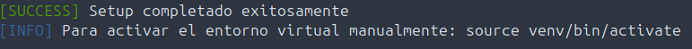


## Paso 2: Entrenamiento del Modelo (Train)
Entrenar nuestro modelo de machine learning. Este proceso toma los datos de los pingüinos Palmer y enseña al algoritmo a reconocer patrones que le permitan clasificar especies.

Ejecutar el comando de entrenamiento:

```bash
./run.sh train
```

**Ouput cuando funciona correctamente:**
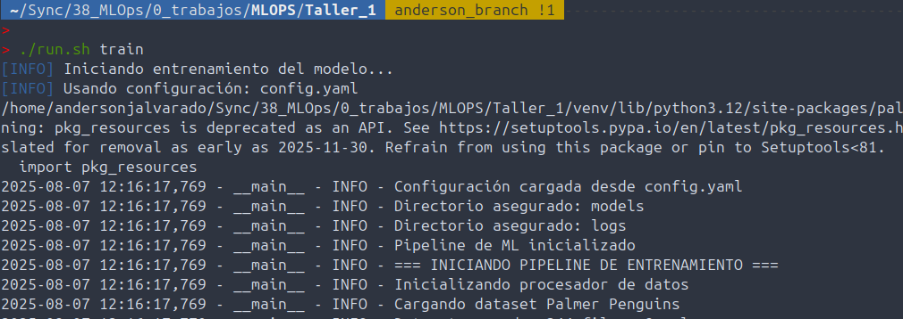

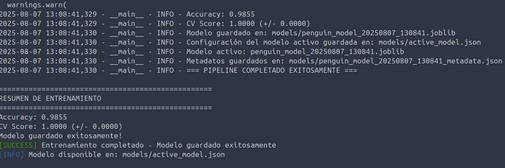


**Verificación post-entrenamiento:** Después del entrenamiento, se puede verificar que el modelo se guardó correctamente:
```bash
# Verificar que el modelo fue creado
ls -la models/
```


## Paso 3: Verificación del Estado del Proyecto
Antes de proceder con la API, es prudente verificar que todos los componentes están en su lugar. Nuestro script incluye una función especial para esto:

```bash
./run.sh status
```

**Ouput cuando funciona correctamente:**
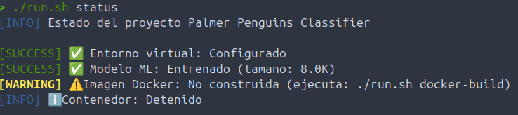


## Paso 4: Ejecutar la API (Prueba del Sistema Completo)

Ejecutar la API:

```bash
./run.sh api
```

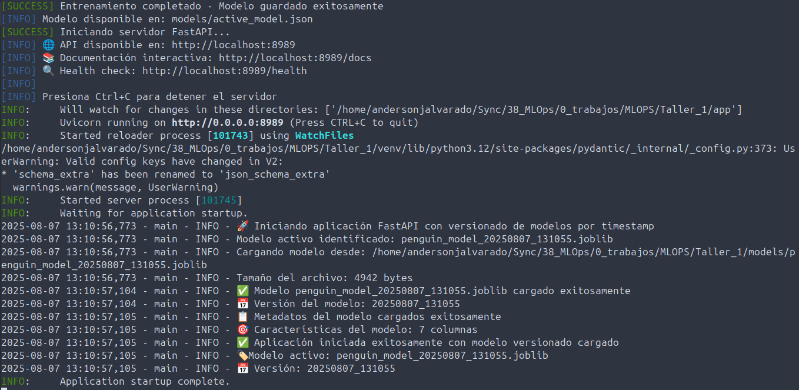

El mensaje "Application startup complete" es la señal de que todo está funcionando. En este punto, la API está viva y respondiendo peticiones.


**Probando la API:** En el navegador se puede ver la api corriendo en el respectivo host y puerto.
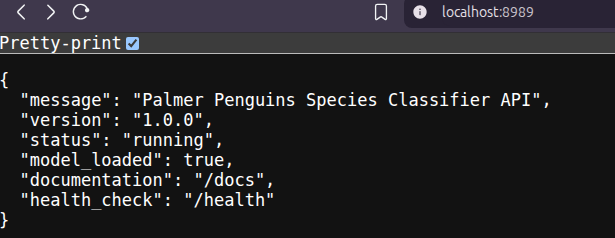


**Probando la API - Método 1: Health Check**
Abrir una segunda terminal (manteniendo la primera con la API ejecutándose) y ejecutar:

```bash
curl http://localhost:8989/health
```

Tambien desde el navegador se puede ir al método:
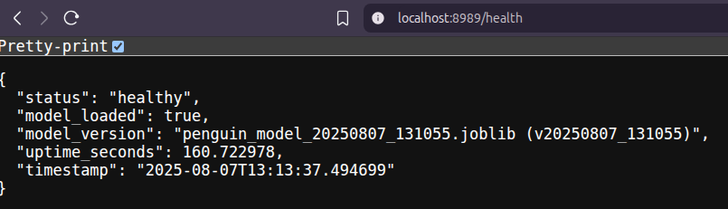


**Probando la API - Método 2: Predicción Real**

Ahora probemos una predicción real con datos de un pingüino:

```bash
curl -X POST "http://localhost:8989/predict" \
     -H "Content-Type: application/json" \
     -d '{
       "island": "Biscoe",
       "bill_length_mm": 39.1,
       "bill_depth_mm": 18.7,
       "flipper_length_mm": 181.0,
       "body_mass_g": 3750.0,
       "sex": "male"
     }'
```

**Respuesta esperada de una predicción exitosa:**
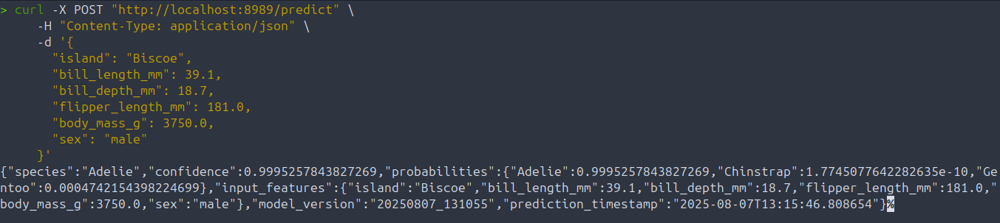

**Cómo interpretar la respuesta:** El campo `species` da la predicción final, `confidence` dice qué tan seguro está el modelo, y `probabilities` muestra las probabilidades para cada especie posible. 

**Probando la API - Método 3: Interfaz Web Interactiva**

FastAPI automáticamente genera una interfaz web interactiva. Abrir el navegador e ir a:

```
http://localhost:8989/docs
```

Así se puede experimentar con diferentes valores y entender cómo responde el modelo.
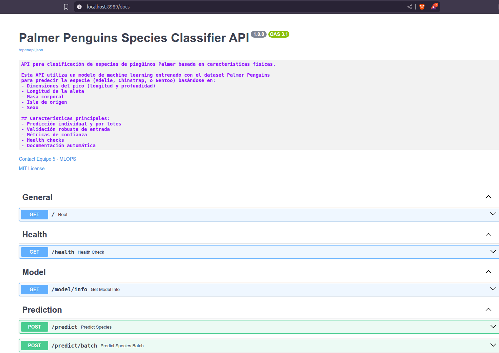


Al realizarle las peticiones la api responde:
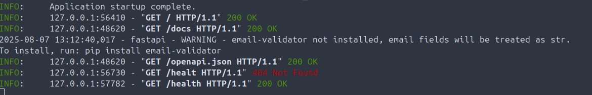


## Paso 5: Verificación con Docker
Para desplegar la aplicación en un contenedor Docker. 

**Construir la imagen Docker:**

```bash
./run.sh docker-build
```

**Output esperado:**
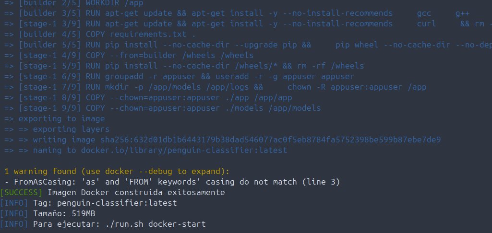


**Ejecutar el contenedor:**

Antes de ejecutarlo, asegurarse tener el puerto libre de la anterior ejecucion de la api en el ambiente virtual para que Docker pueda usar el puerot asignado. Error de puerto:
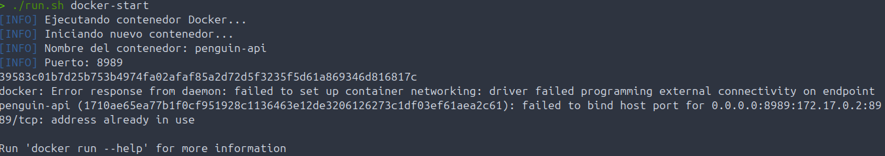

Terminar API en ambiente virtual para liberar puerto `ctrl + C`:

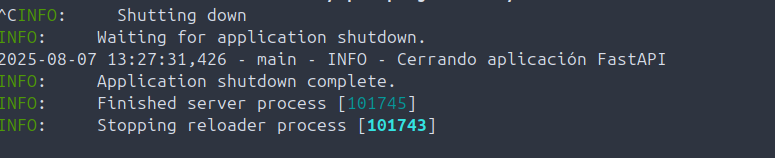

Ejecutar docker;
```bash
./run.sh docker-start
```

**Output esperado:**
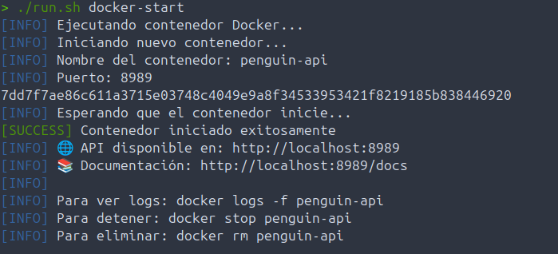


**Verificación de que el contenedor funciona:**

```bash
# Verificar que el contenedor está ejecutándose
docker ps

# Probar la API en el contenedor
curl http://localhost:8989/health
```


Así mismo, se pueden probar las respuestas de la api está vez corriendo en un contenedor.

Probar método `predict/batch`:
```bash
curl -s -X POST "http://localhost:8989/predict/batch" \
         -H "Content-Type: application/json" \
         -d '{
           "penguins": [
             {
               "island": "Biscoe",
               "bill_length_mm": 39.1,
               "bill_depth_mm": 18.7,
               "flipper_length_mm": 181.0,
               "body_mass_g": 3750.0,
               "sex": "male"
             },
             {
               "island": "Dream",
               "bill_length_mm": 46.5,
               "bill_depth_mm": 17.9,
               "flipper_length_mm": 192.0,
               "body_mass_g": 3500.0,
               "sex": "female"
             }
           ]
         }'
```

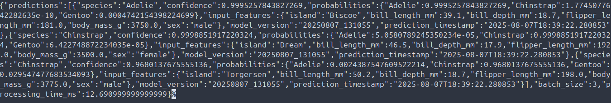

## Logs y Troubleshooting
Durante todo este proceso, es importante entender cómo los logs e identificar problemas potenciales.

**Logs del entrenamiento:** Se guardan en `logs/training.log`. Si algo falla durante el entrenamiento, aquí se encuentra información sobre qué salió mal.

**Logs de la API:** Aparecen en la consola donde se ejecutó `./run.sh api`. 

**Logs del contenedor Docker:** Se pueden ver los logs con:
```bash
docker logs -f penguin-api
```
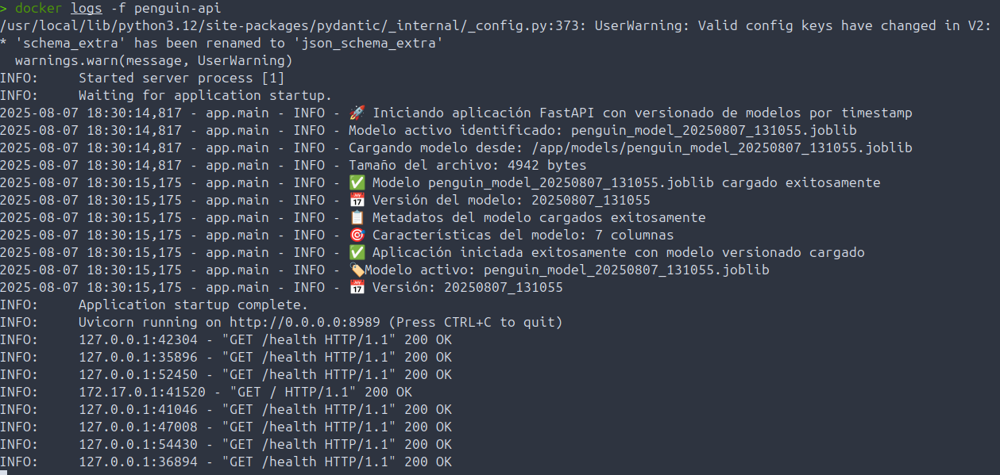


# Bono
Para probar diferentes modelos se debe espificar en el archivo de configuración `config.yaml` en la opción de `model:type`.

Para hacerlo desde consola:
1. Detener el contenedor
```bash
docker stop penguin-api
```

2. Especificar el modelo de clasificación. Se cuenta con 3 opciones: Regresión Logística = logistic, Random Forest = random_forest y Support Vector Machine = svm (por defecto estaba en logistic).
``` bash
sed -i 's/type: .*/type: "random_forest"/' config.yaml
```
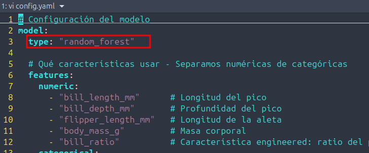

3. Los modelos se guardan en la carpeta `models/` que está montada como volumen, por lo que serán accesibles desde el contenedor. Ejecutar el entramiento nuevamente.
``` bash
./run.sh train
```
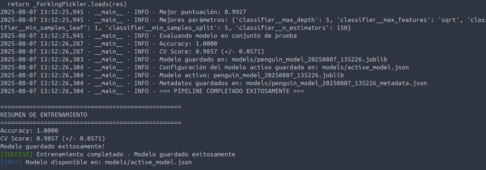

4. Reiniciar el contenedor de nuevo:
``` bash
./run.sh docker-start
```

5. Con una llamada a la API se puede verificar los datos del nuevo modelo: `/model/info`
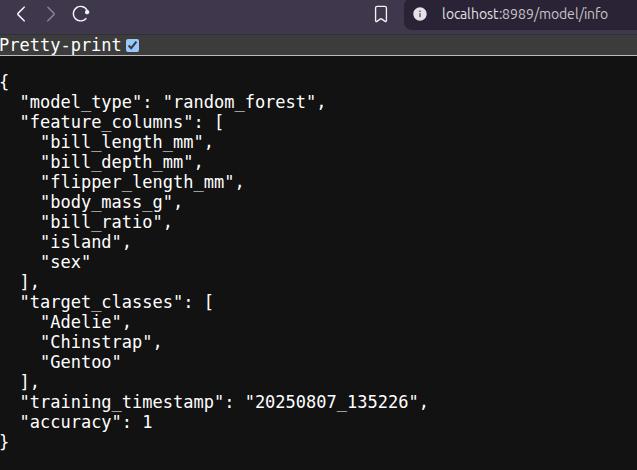

6. Se pueden crear los contenedores con los modelos necesarios, o automatizar el proceso para que el usuario pueda elegir el modelo a entrenar.


# Finalizar
Al finalizar se pueden limpiar logs y contenedores que ejecutó y produjo la API.
``` bash
./run.sh clean
```
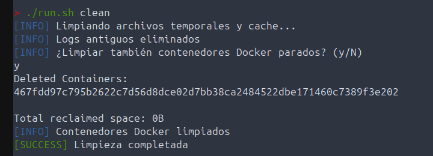
