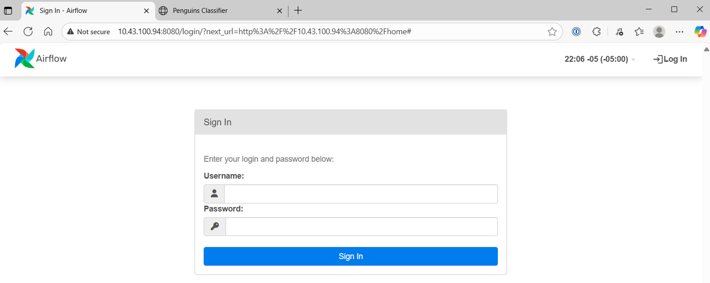
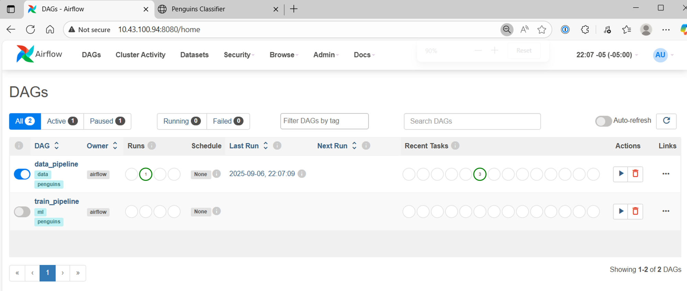
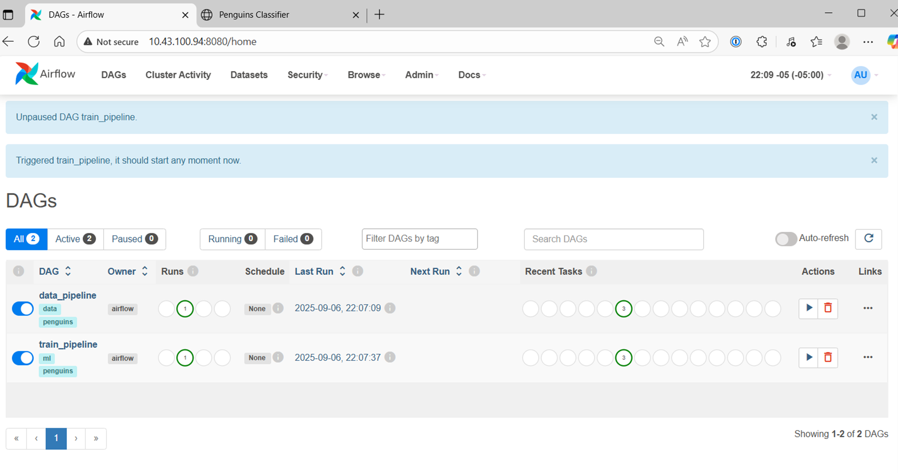
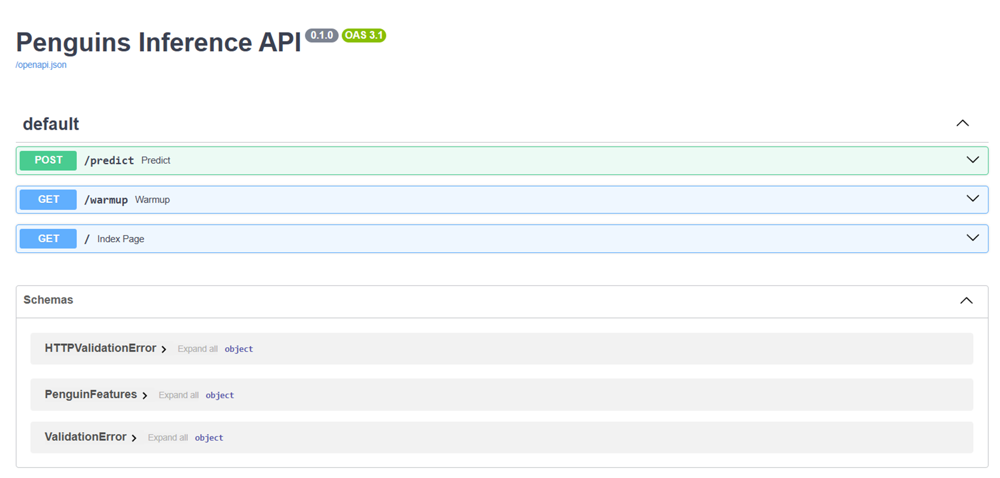
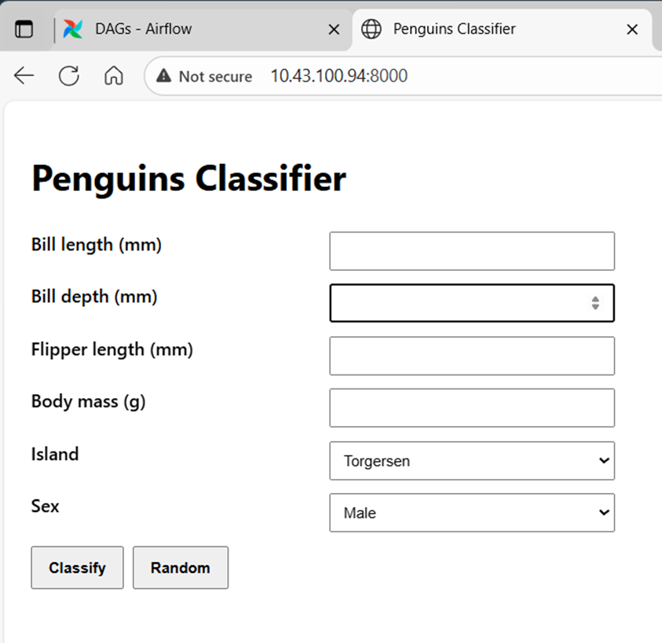
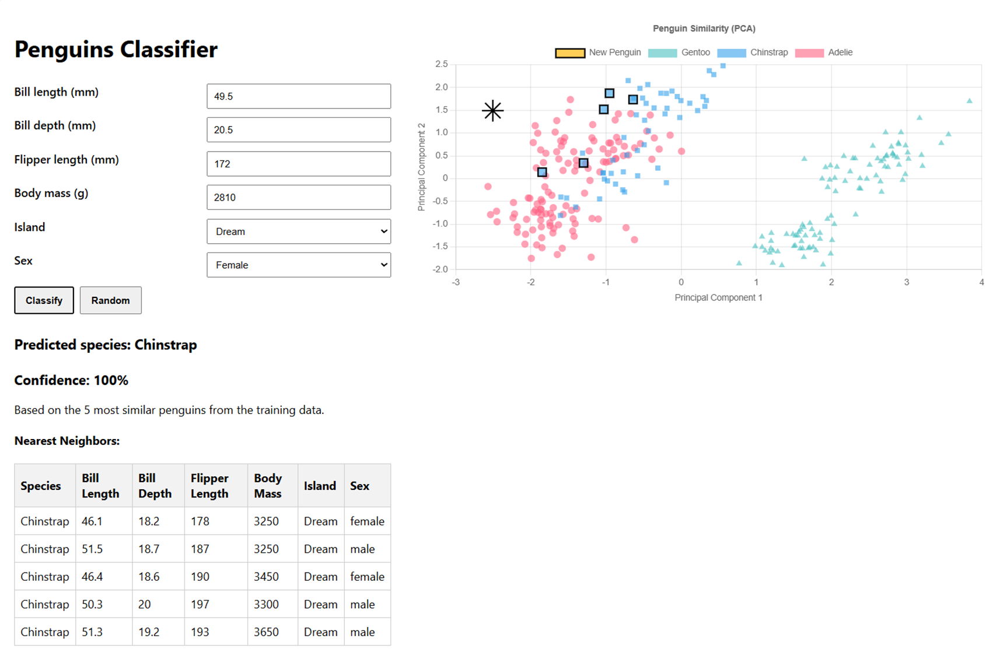
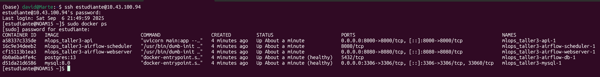

# Manual de uso (paso a paso)

Este manual guía a cualquier usuario, sin conocimientos previos del proyecto, para poner en marcha y utilizar el sistema de clasificación de pingüinos.

> Consejo: Si es tu primera vez con Docker, lee primero el apartado “Preguntas frecuentes y solución de problemas” al final.

---
## 1) Requisitos previos

- Docker y Docker Compose instalados
- 4 GB de RAM libres recomendados
- Puertos disponibles: 8080 (Airflow), 8000 (API), 3306 (MySQL)

---
## 2) Descargar el proyecto

```bash
# Clonar el repositorio
git clone https://github.com/davidm094/MLOPS_Taller3.git
cd MLOPS_Taller3
```

---
## 3) Arrancar los servicios

```bash
# Construir e iniciar todos los servicios (Airflow, MySQL, API)
docker compose up -d --build

# Verificar estado
docker compose ps
```

- Deberías ver `airflow-webserver`, `airflow-scheduler`, `mysql`, `airflow-db` y `api` en estado `Up/Healthy`.

> Captura sugerida: Pantalla de `docker compose ps` mostrando los contenedores.

---
## 4) Primera ejecución en Airflow

1) Abre Airflow: `http://localhost:8080` (usuario: `admin`, contraseña: `admin`).

2) En la página de DAGs, habilita y ejecuta en este orden:
   - `data_pipeline` (ingesta y limpieza de datos)
   - `train_pipeline` (entrenamiento y generación de artefactos). Al finalizar, el DAG llama automáticamente al endpoint `/warmup` de la API para precargar el modelo.

3) Comprueba que ambos DAGs terminan en verde (estado “Success”).

Capturas de referencia:








---
## 5) Verificar artefactos generados (opcional)

En la carpeta del proyecto:
```bash
ls -l artifacts/
```
Deberías encontrar archivos como `model.joblib`, `preprocessor.joblib`, `label_encoder.joblib`, `training_data_for_viz.joblib`, `pca.joblib`.

> Captura sugerida: Listado de ficheros dentro de `artifacts/`.

---
## 6) Probar la API web (clasificación interactiva)

Abre `http://localhost:8000` en tu navegador. Verás:
- Un formulario para introducir características del pingüino.
- Botón “Random” para generar valores realistas.
- Al pulsar “Classify”: resultado con especie, confianza y explicación visual.
- Gráfico PCA con:
  - Tu pingüino (estrella amarilla)
  - Vecinos más cercanos (resaltados)
  - Distribución de especies del conjunto de entrenamiento (colores por especie)

Capturas de referencia:








---
## 7) Probar la API por consola (curl)

```bash
curl -s -X POST http://localhost:8000/predict \
  -H 'Content-Type: application/json' \
  -d '{
    "bill_length_mm": 46.2,
    "bill_depth_mm": 13.7,
    "flipper_length_mm": 229,
    "body_mass_g": 5090,
    "island": "Dream",
    "sex": "Female"
  }' | jq .
```
Salida esperada (ejemplo):
```json
{
  "predicted_species": "Gentoo",
  "confidence": 0.8,
  "neighbors": [
    { "features": { ... }, "species": "Gentoo" },
    ...
  ],
  "viz_data": { ... }
}
```

---
## 8) Flujo típico de trabajo

1) Arrancar servicios con `docker compose up -d --build` (solo la primera vez o cuando cambian dependencias).
2) Ejecutar `data_pipeline` → `train_pipeline` en Airflow.
3) Usar la API/UI en `http://localhost:8000` para clasificar pingüinos.
4) Repetir los DAGs si deseas reentrenar el modelo.

---
## 9) Preguntas frecuentes y solución de problemas

- **La API responde 503 y dice que faltan artefactos del modelo**
  - Ejecuta `train_pipeline` en Airflow; el DAG precarga la API automáticamente (warmup).

- **Permisos al guardar artefactos** (`PermissionError` en `/opt/artifacts/...`)
  - En Linux: dentro del repositorio ejecuta:
    ```bash
    sudo chown -R 50000:0 artifacts
    sudo chmod -R 775 artifacts
    ```
  - Alternativa más limpia: `.env` con `AIRFLOW_UID=$(id -u)` y reiniciar el stack.

- **Red/descarga de dataset**
  - El proyecto usa `palmerpenguins` (PyPI) como fuente principal. No requiere acceso a Kaggle.

- **Reconstruir cuando cambian dependencias de Airflow**
  ```bash
  docker compose build airflow-init airflow-webserver airflow-scheduler
  docker compose up -d
  ```

- **Logs**
  - Airflow (scheduler/webserver) en la UI o:
    ```bash
    docker compose logs airflow-scheduler | tail -n 200
    docker compose logs airflow-webserver | tail -n 200
    ```
  - API:
    ```bash
    docker compose logs api | tail -n 200
    ```

---
## 10) Estructura del proyecto (resumen)

```
airflow/
├── dags/                  # data_pipeline, train_pipeline
├── Dockerfile             # imagen custom de Airflow
└── requirements.txt       # dependencias de los DAGs
api/
├── Dockerfile
├── main.py                # API + UI + PCA + vecinos
└── requirements.txt
artifacts/                 # artefactos del modelo (generados por Airflow)
docker-compose.yml         # orquestación de servicios
README.md                  # documentación técnica
MANUAL.md                  # este manual paso a paso
INFORME_IMPLEMENTACION.md  # informe de implementación
img/                       # capturas
```

---
## 11) Siguientes pasos (opcional)

- Automatizar pruebas de build y smoke-test (GitHub Actions).
- Versionado de modelos y almacenamiento en objeto (S3/MinIO).
- Monitoreo (latencia de inferencia, drift de datos, salud de DAGs).

---
## Anexo: Entorno de ejecución (VM)



