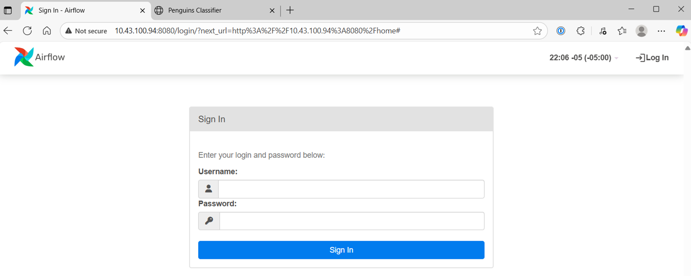
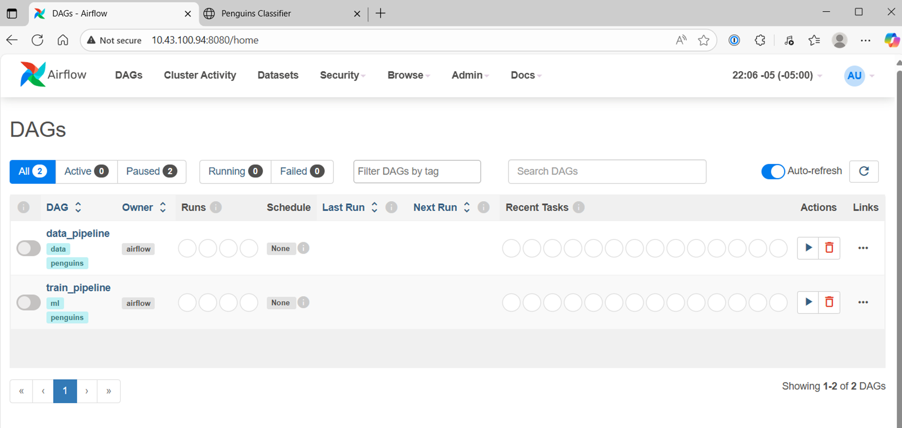
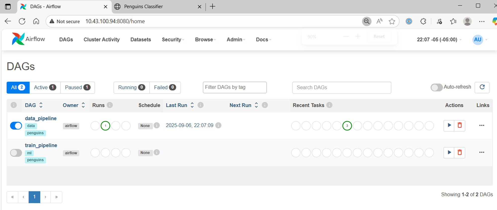
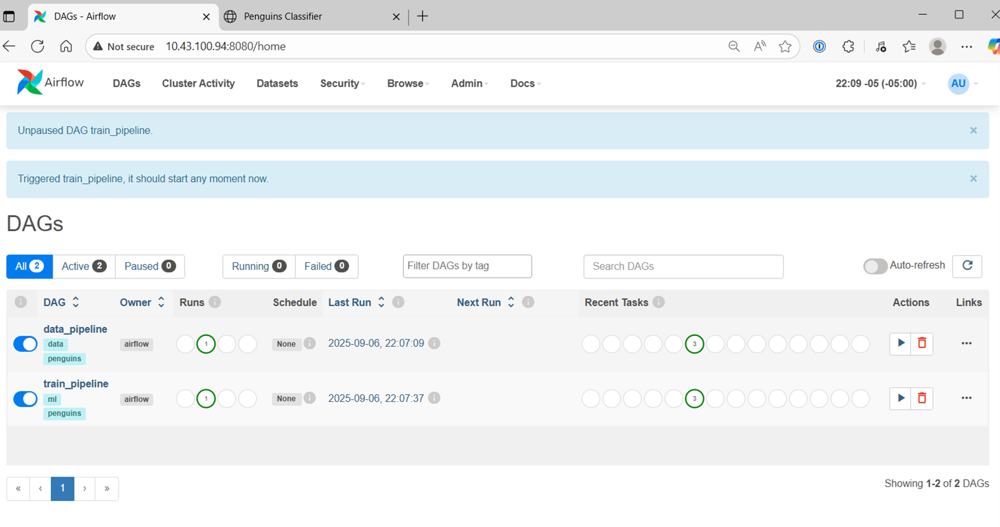
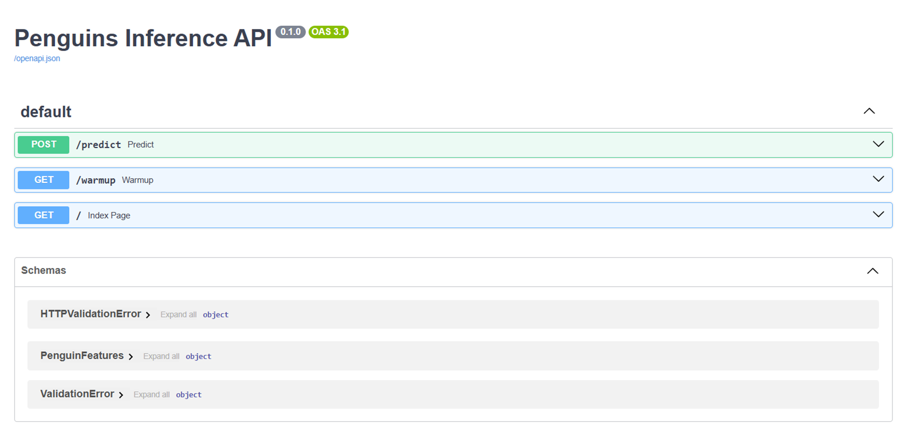
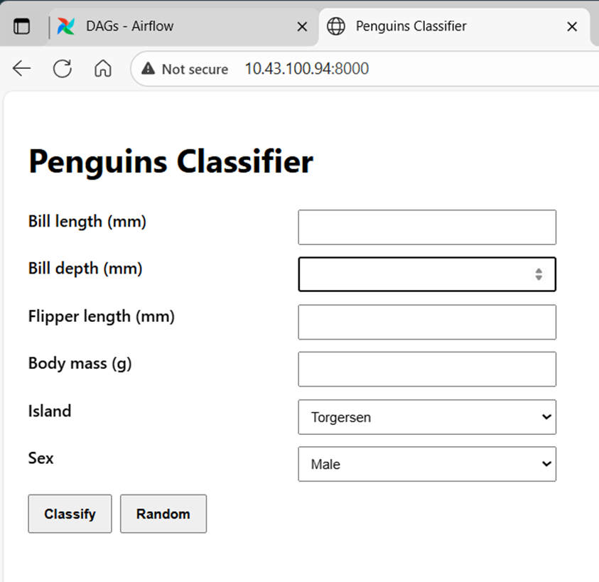
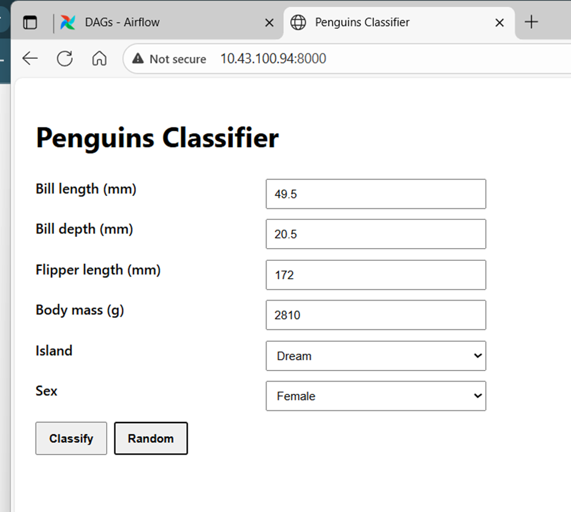
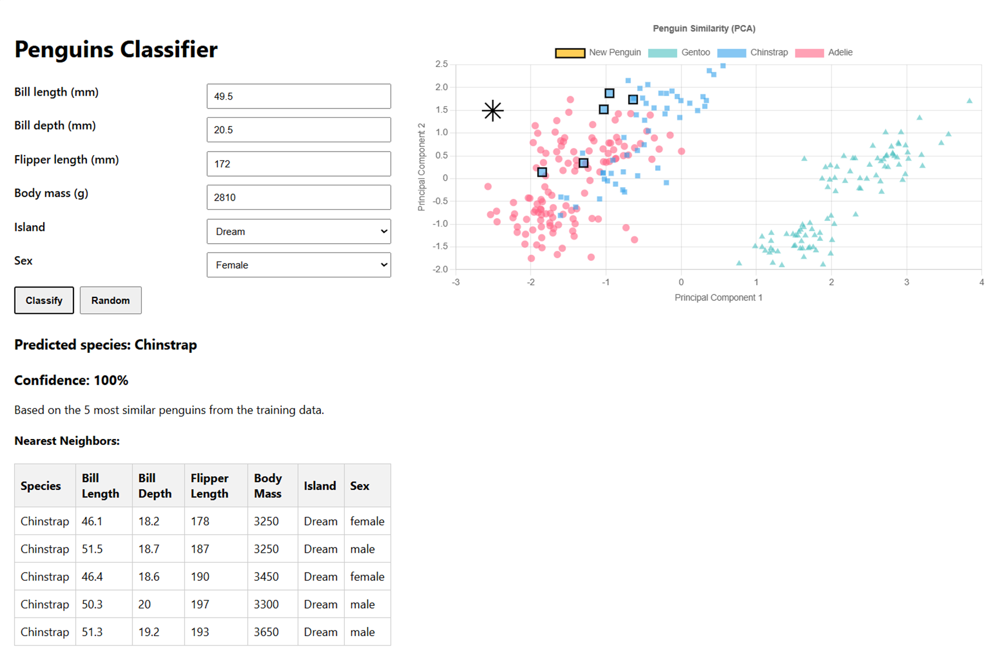
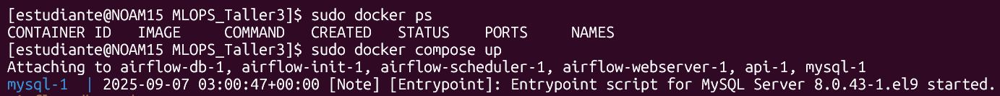
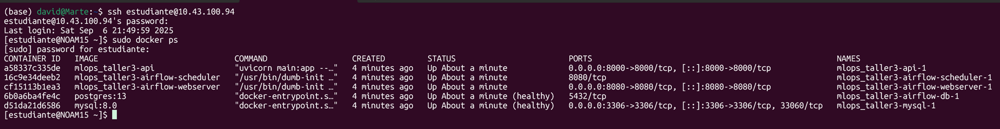

# Taller 03 - MLOps: Pingüinos Classifier con Airflow, FastAPI y Docker

Este proyecto implementa un pipeline de Machine Learning de extremo a extremo para entrenar un modelo que clasifica especies de pingüinos y lo expone a través de una API web. Todo el sistema está orquestado y contenerizado usando Apache Airflow y Docker Compose.

## Arquitectura del Proyecto

El sistema se compone de los siguientes servicios interconectados, definidos en `docker-compose.yml`:

-   **`api` (FastAPI Web Service):**
    -   **Propósito:** Servir el modelo de clasificación a través de una API REST.
    -   **UI Web:** Ofrece una interfaz gráfica simple en `http://localhost:8000` para interactuar con el modelo.
    -   **Endpoint:** Expone `/predict` para recibir las características de un pingüino y devolver la especie predicha.
    -   **Resiliencia:** Arranca aun si no existen artefactos (devuelve `503` en `/predict` hasta que los artefactos estén disponibles).
    -   **Explicabilidad:** Muestra 5 vecinos más cercanos y un gráfico PCA 2D con la distribución de especies, resaltando el pingüino clasificado y sus vecinos.

-   **`airflow-webserver` & `airflow-scheduler` (Orquestador):**
    -   **Propósito:** Orquestar todo el pipeline de datos y entrenamiento.
    -   **DAGs:**
        1.  `data_pipeline`: Ingesta, limpieza y almacenamiento MySQL (`penguins_raw`, `penguins_clean`).
        2.  `train_pipeline`: Entrena el modelo, genera artefactos (modelo, preprocesador, label encoder, PCA y muestra de entrenamiento para viz) y, al final, llama **automáticamente** al endpoint `/warmup` de la API para cargar artefactos.
    -   **Imagen Custom:** `airflow/Dockerfile` hornea dependencias de Python (mejor práctica).

-   **`mysql` (Base de Datos de Datos):**
    -   **Propósito:** Almacén dedicado para los datos del pipeline: `penguins_raw`, `penguins_clean`.

-   **`airflow-db` (PostgreSQL - Metadatos):**
    -   **Propósito:** Base de metadatos de Airflow (estado de DAGs, ejecuciones, etc.).

-   **Volúmenes Compartidos**
    -   **`artifacts/`:** Directorio compartido donde Airflow escribe artefactos y la API los consume.

## Puesta en marcha desde 0 (entorno nuevo)

- **Requisitos previos**
  - Docker y Docker Compose instalados
  - 4 GB RAM libres sugeridos
  - Puertos disponibles: 8080 (Airflow), 8000 (API), 3306 (MySQL)

- **Clonar el repo y entrar al directorio**
  ```bash
  git clone https://github.com/davidm094/MLOPS_Taller3.git
  cd MLOPS_Taller3
  ```

- **Construir e iniciar servicios**
  ```bash
  docker compose up -d --build
  ```

- **(Solo si ves errores de permisos al entrenar)**: da permisos de escritura a `artifacts/`
  ```bash
  # Opción rápida (recomendada si falla el entrenamiento por permisos)
  sudo chown -R 50000:0 artifacts
  sudo chmod -R 775 artifacts   # si persiste, usar 777
  ```
  Alternativa (más limpia): definir `AIRFLOW_UID=$(id -u)` en un `.env` junto al compose y reiniciar, para que Airflow use tu UID del host.

- **Primera ejecución (UI de Airflow y DAGs)**
  1. Abre `http://localhost:8080` (usuario: `admin`, pass: `admin`).
  2. Ejecuta el DAG `data_pipeline`.
  3. Ejecuta el DAG `train_pipeline`.
     - Al finalizar, el DAG llama al endpoint `/warmup` de la API para precargar artefactos.

- **Probar la aplicación**
  - UI web: `http://localhost:8000` (formulario + gráfico PCA + vecinos)
  - Vía curl:
    ```bash
    curl -s -X POST http://localhost:8000/predict -H 'Content-Type: application/json' \
      -d '{"bill_length_mm":46.2,"bill_depth_mm":13.7,"flipper_length_mm":229,"body_mass_g":5090,"island":"Dream","sex":"Female"}'
    ```

## Estructura de Archivos

```
airflow/
├── dags/
│   ├── data_pipeline.py      # DAG: ingesta y limpieza
│   └── train_pipeline.py     # DAG: entrenamiento, artefactos, warmup API
├── Dockerfile                # Imagen custom de Airflow con dependencias
└── requirements.txt          # Dependencias Python para los DAGs
api/
├── Dockerfile
├── main.py                   # API (FastAPI) + UI + PCA chart + neighbors
└── requirements.txt
artifacts/                    # (Generado por Airflow) Artefactos del modelo
docker-compose.yml            # Orquesta todos los servicios
README.md                     # Esta documentación
MANUAL.md                     # Guía paso a paso
INFORME_IMPLEMENTACION.md     # Informe de implementación y retos
img/                          # Capturas usadas en la documentación
```

## Documentación relacionada

- Manual de uso paso a paso: [MANUAL.md](MANUAL.md)
- Informe de implementación y retos: [INFORME_IMPLEMENTACION.md](INFORME_IMPLEMENTACION.md)

## Capturas de la Solución (por flujo)

- Datos y Entrenamiento (Airflow)

  

  

  

  

- Inferencia (API Web)

  

- Resultados y Visualización

  

  

  

- Entorno de Ejecución

  
  
  

## Artefactos del Modelo

- `preprocessor.joblib`: `ColumnTransformer` (scaler + OHE) entrenado.
- `model.joblib`: Clasificador `RandomForest` entrenado.
- `label_encoder.joblib`: Codificador de etiquetas de especie.
- `pca.joblib`: Modelo PCA (2 componentes) entrenado para visualización.
- `training_data_for_viz.joblib`: Muestra de entrenamiento con:
  - `features_raw`: DataFrame original de features de entrenamiento.
  - `features_pca`: DataFrame con columnas `pca1`, `pca2` (para el gráfico).
  - `labels_encoded`: Etiquetas codificadas (mapeables vía `label_encoder`).

## Troubleshooting Rápido

- **API en 503 / “model artifacts not found”**
  - Ejecuta `train_pipeline` (hace warmup automáticamente al final).

- **Permisos de `artifacts/`**
  - Si aparece `PermissionError: /opt/artifacts/...`:
    ```bash
    sudo chown -R 50000:0 artifacts && sudo chmod -R 775 artifacts
    ```
  - Alternativa: usar `.env` con `AIRFLOW_UID=$(id -u)` y reiniciar el stack.

- **Descarga de dataset falla / redes restringidas**
  - Usamos `palmerpenguins` como fuente principal (PyPI) y `seaborn` como fallback. No se requieren credenciales ni Kaggle.

## Decisiones de Diseño

- Dependencias horneadas en imágenes (no `PIP_ADDITIONAL_REQUIREMENTS`) para reproducibilidad.
- División de DAGs por responsabilidad (datos vs. entrenamiento).
- API con carga perezosa y endpoint `/warmup` para robustez de arranque.
- Visualización PCA + vecinos para interpretabilidad del resultado.


