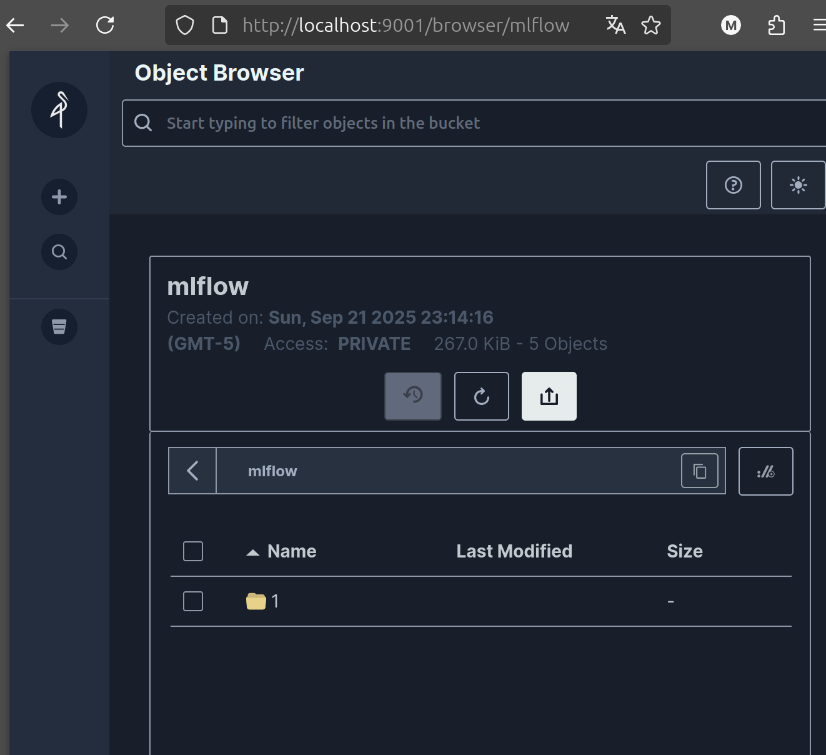
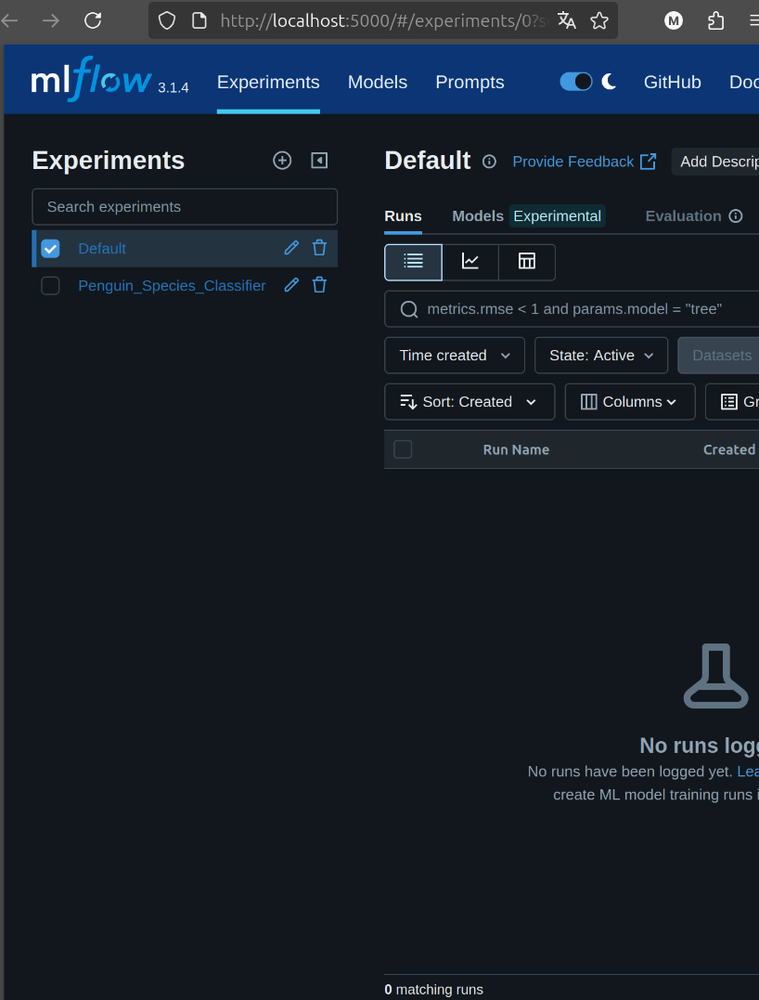
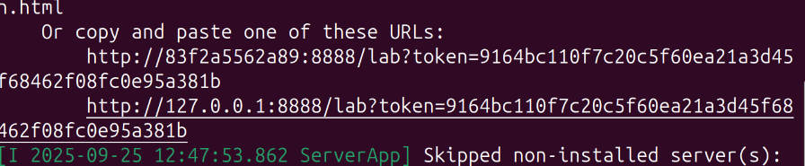
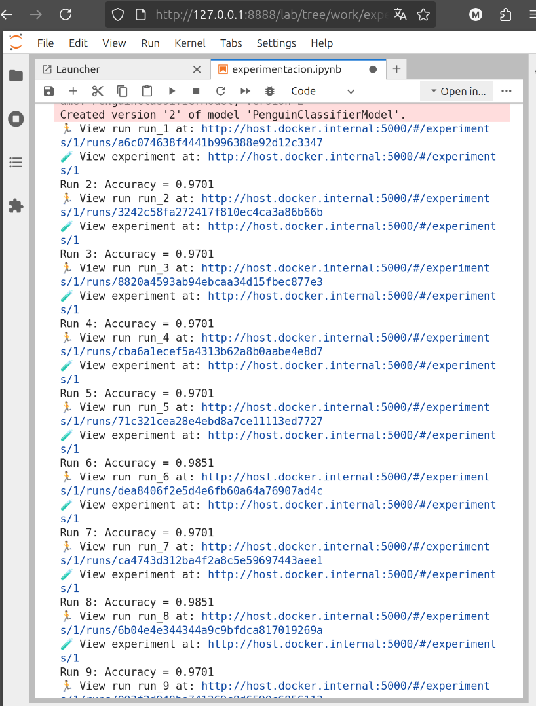
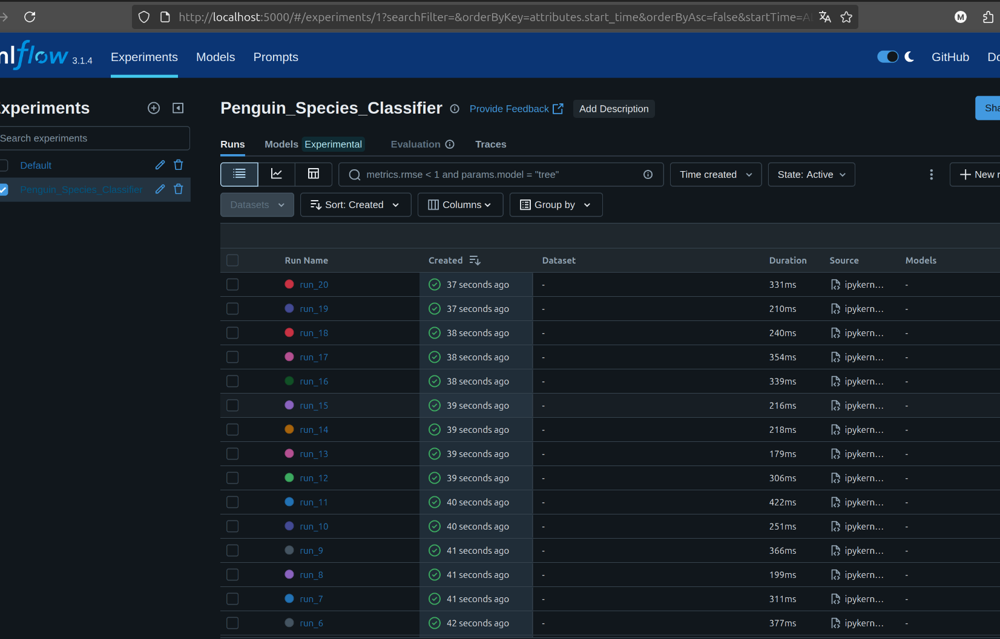
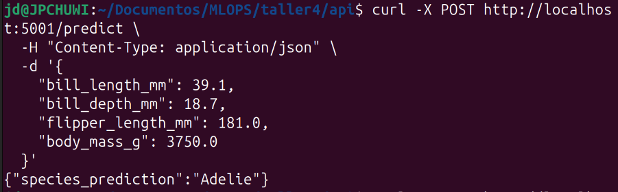

# Taller 4: MLflow Nivel 2: MLOps

Este documento describe los pasos necesarios para ejecutar y validar el taller de MLflow Nivel 2, implementando un pipeline completo de MLOps: entrenamiento de modelos, registro en MLflow, almacenamiento de artefactos y servicio de inferencia.

---
## 1. Arquitectura del proyecto

El sistema cuenta con los siguientes componentes:
- **JupyterLab:** Contenedor para experimentación y entrenamiento de modelos.
- **MLflow Tracking Server:** Registro de experimentos y modelos.
- **Base de Datos:** PostgreSQL o SQLite, para almacenar metadatos de los experimentos.
- **MinIO S3 Storage:** Almacén de objetos compatible con S3 para guardar artefactos.
- **API de Inferencia (Flask):** Permite consumir modelos entrenados para predicciones en tiempo real.

---
## 2. Flujo de datos en el proyecto para comprobacion

-   El notebook en JupyterLab entrena modelos y registra parámetros, métricas y artefactos en MLflow.
-   MLflow guarda los metadatos en la base de datos y la ubicación de los artefactos en MinIO.
-   La API de inferencia obtiene el modelo desde MLflow y devuelve predicciones a los usuarios.

---
## 3. Configuración y ejecución de servicios

El sistema está compuesto por cinco servicios principales que se comunican a través de la red de Docker y los puertos expuestos en el host.

### 3.1 MinIO (almacenamiento de artefactos)

- 1. Levantamiento de el contenedor:
```bash
docker compose up --build -d
```
Este comando inicia los tres servicios en segundo plano. Puedes verificar que están corriendo correctamente con docker ps.
- 2. Creación del bucket:
    Acceder a la consola de MinIO en http://localhost:9001.
    Iniciar sesión con admin / supersecret.
    Crear un nuevo bucket llamado **mlflow**.
    
#### Evidencias: 




### 3.2 Ejecución de el contenedor de JupyterLab

Este comando incluye la configuración de red y las variables de entorno necesarias para que el contenedor de Jupyter se pueda comunicar con los servicios de backend.
```bash
docker run -it --name jupyter_dev --rm \
  --add-host=host.docker.internal:host-gateway \
  -e AWS_ACCESS_KEY_ID=admin \
  -e AWS_SECRET_ACCESS_KEY=supersecret \
  -e MLFLOW_S3_ENDPOINT_URL=http://host.docker.internal:9000 \
  -p 8888:8888 \
  -v "${PWD}/notebooks:/home/jovyan/work" \
  taller_jupyterlab
```
#### Evidencias: 



### 3.3 Entrenar y registrar el modelo

- Al ejecutar el comando anterior aparecera una url en el terminal: http://127.0.0.1:8888/lab?token=...,
- Copiar esta URl y acceder desde navegador
- En JupyterLab correr el notebook experimentacion.ipynb, lo cual hara 20 runs sin errores en la salida de celda.

#### Evidencias: 


### 3.4 Validar registros en Mlflow

- Navegar a la interfaz de MLflow: http://localhost:5000.
- Verificar que en la pestaña "Experiments" aparece Penguin_Species_Classifier con 20 ejecuciones.
- Verifica que en la pestaña "Models" aparece el modelo PenguinClassifierModel registrado.

#### Evidencias: 


---
## 4. Servir y consumir el servicio

Con un modelo entrenado y registrado, lanzamos una API REST que lo cargará para servir predicciones.

### 4.1 Configurar el Entorno Virtual de la API

En otra terminal ejecutar:
```bash
# Navega al directorio
cd api/

# Crear y activar el entorno virtual
python3 -m venv venv
source venv/bin/activate
```

### 4.2 Instalar Dependencias Sincronizadas

Instala las librerías especificadas en requirements.txt. Es crucial que estas versiones (especialmente scikit-learn) coincidan con las del entorno de entrenamiento para evitar conflictos, actualmente vinculas a scikit-learn==1.3.1

```bash
python -m pip install -r requirements.txt
```

### 4.3 Iniciar el Servidor de la API

```bash
python3 api.py
```

Si el inicio es exitoso, se evidenciara un mensaje indicando Modelo cargado exitosamente. y que el servidor está corriendo en http://0.0.0.0:5001.

### 4.4 Realizar una prueba de inferencia

En una nueva terminal, para actuar como cliente y enviar una petición de prueba a la API:

```bash
curl -X POST http://localhost:5001/predict \
  -H "Content-Type: application/json" \
  -d '{
    "bill_length_mm": 39.1,
    "bill_depth_mm": 18.7,
    "flipper_length_mm": 181.0,
    "body_mass_g": 3750.0
  }'
```

Para este curl se espera una respuesta json:

```bash
{"species_prediction":"Adelie"}
```
#### Evidencias:



